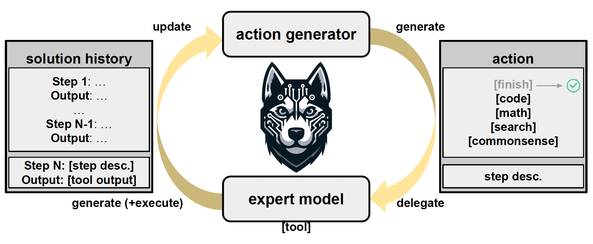
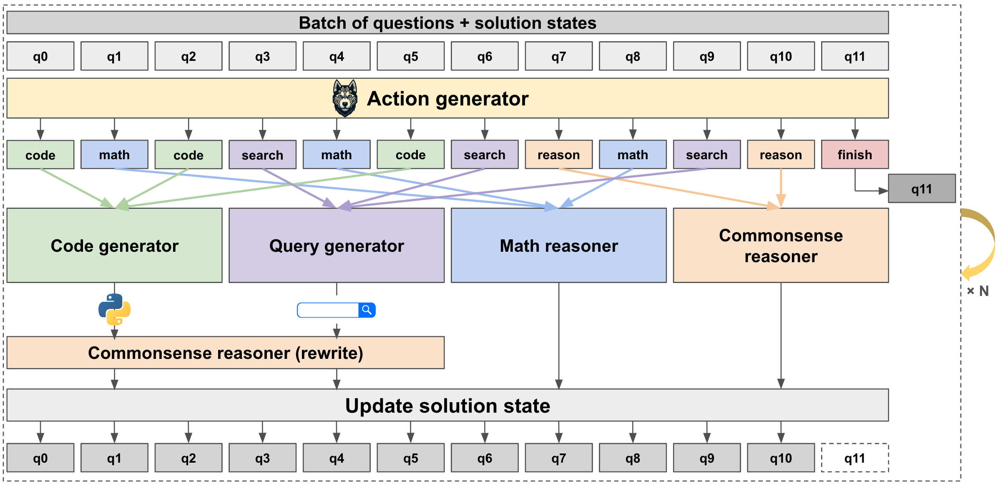

# Husky-v1
This repository contains the official code for the first iteration of **Husky**, an open-source language agent that solves complex, multi-step reasoning tasks via tool use.

[Paper](https://arxiv.org/abs/2406.06469) | [Website](https://agent-husky.github.io/) | [HuggingFace](https://huggingface.co/agent-husky)

**Husky-v1** addresses numerical, tabular and knowledge-based reasoning tasks.
**Husky** iterates between two stages: 1) generating the next action to take towards solving a given task, and 2) executing the action using expert models and updating the current solution state.
**Husky-v1** uses a [code generator](https://huggingface.co/agent-husky/husky-v1-code-deepseekcoder-7b-instruct), a [query generator](https://huggingface.co/agent-husky/husky-v1-query-llama2-7b) and a [math reasoner](https://huggingface.co/agent-husky/husky-v1-math-deepseekmath-7b-instruct) as expert models.



## Installation
To get started with the code, first move to the main directory.
```
cd husky
```

Then, install the required packages. Note that our system uses `CUDA 11.8`.
```
pip install -r requirements.txt
```

## Download the models
Visit our [HuggingFace collection](https://huggingface.co/collections/agent-husky/husky-v1-665545c3e6ea63012f35c518) for Husky-v1 and download the associated models.
- [action generator (7B)](https://huggingface.co/agent-husky/husky-v1-action-llama2-7b)
- [action generator (13B)](https://huggingface.co/agent-husky/husky-v1-action-llama2-13b)
- [code generator](https://huggingface.co/agent-husky/husky-v1-code-deepseekcoder-7b-instruct)
- [math reasoner](https://huggingface.co/agent-husky/husky-v1-math-deepseekmath-7b-instruct)
- [query generator](https://huggingface.co/agent-husky/husky-v1-query-llama2-7b)

## Inference
We use [vLLM](https://docs.vllm.ai/en/stable/) to perform inference with **Husky**.
Below is an overview of our optimized inference procedure, where we execute all expert models in parallel and handle all LM generations in batches.



Run the following commands in parallel to run Husky. As there are five expert models running in parallel for each task, we recommend having an access to five GPUs or finding a way to run multiple models on the same GPU. Note that `run_husky_update.sh` does not involve GPU usage.
```
sh run_husky_action.sh
```
```
sh run_husky_code.sh
```
```
sh run_husky_math.sh
```
```
sh run_husky_query.sh
```
```
sh run_husky_reason.sh
```
```
sh run_husky_update.sh
```

Within each script, modify the `MODEL_ID` attribute as well as the `DATASET_NAME` attribute. 
For example, to run inference with `llama-2-7b` as the action generator and `bamboogle` as the dataset, modify `run_husky_action.sh` as:
```
MODEL_ID="action-generator-unified-llama2-7b"
DATASET_NAME="bamboogle"
```

To run inference for Google DeepMind mathematics and MathQA, set `DATASET_NAME=lila` and choose `SUBTASK` from `deepmind_mathematics_{algebra/basicmath/calculus/muldiv/numbertheory}` or `mathqa_{gain/general/geometry/physics/probability}`.
Note that we only provide `DROP*`, `IIRC*` and `HuskyQA` through our [HuggingFace space](https://huggingface.co/agent-husky).
Download the datasets and add them as `test.jsonl` to their respective subfolders under the `dataset` folder.

Running `run_husky.sh` will create a subfolder of the format `evals/bamboogle/${SAVE_DIR}`, where `SAVE_DIR` is the name of the directory you would like to store the inference outputs.
The inference for each output will be stored in a JSON file.
For example, the output to question 5 will be stored in `q5.json` under the subfolder.

## Evaluation
After performing inference with the scripts above, run evaluation using `eval_husky.sh`.
```
sh eval_husky.sh
```

Again, set `DATASET_NAME` to the dataset of your choice, and set `SUBTASK` according to the list provided above if `DATASET_NAME=lila`.

## Contact
For any questions, please open an issue mentioning @danieljkim0118 or send an email to jwonkim[at]cs.washington.edu.
